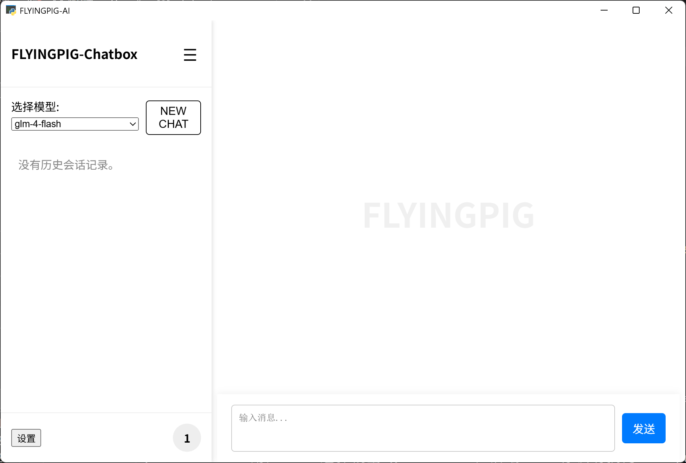
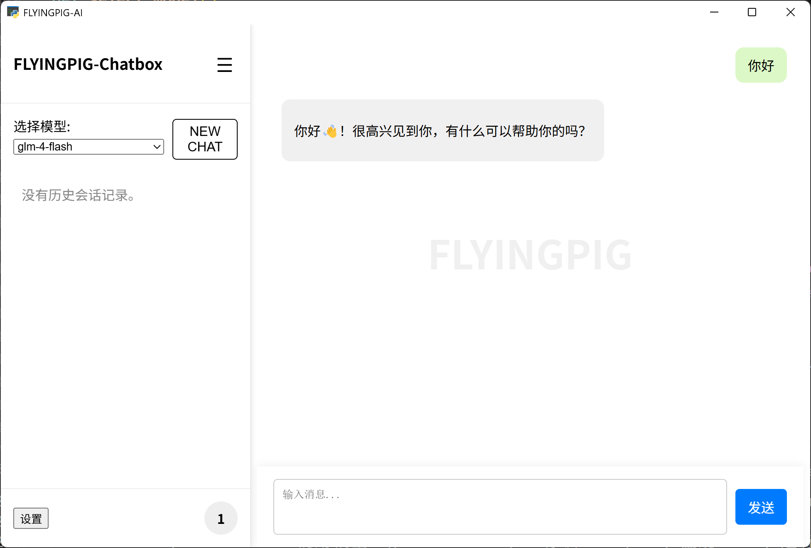

# FLYINGPIG-Chatbox——一个用于统一AI对话的盒子

## 前言

本应用的目的是为了容纳市面上的部分的LLMs（大语言模型）或者本地大模型（ollama部署）(未完成)，并且提供大量的可自定义参数（未完成）用于微调大模型，以用统一的架构来便利用户的使用。

应用内截图





### 目前功能如下

1. 目前只提供三种LLMs进行调用，分别是**deepseek-v3**，质谱ai的**glm-4-flash,** 通义千问的**Qwen/Qwen2.5-7B-Instruct**
2. 提供默认api进行对话（glm-4-flash），但是**会有限制**，用于对话体验
3. 支持本地多用户注册登录和登出
4. 支持本地历史记录储存
5. 支持历史记录分隔
6. 支持历史记录可视化本地查看
7. 支持新建对话

## 安装手册

本指南将引导您完成在本地计算机上安装和运行 FLYINGPIG-Chatbox 的所有必要步骤。请按顺序操作。

**步骤 1：安装 Python (必需)**

FLYINGPIG-Chatbox 是用 Python 编写的，因此您必须先安装 Python 环境。

1. **推荐版本:** 我们建议安装 **Python 3.8 或更高版本**。
2. **下载:** 前往 Python 官方网站下载页面：[https://www.python.org/downloads/](https://www.python.org/downloads/)
3. **安装 (非常重要):**

   * 运行下载的安装程序。
   * 在安装界面的**第一个屏幕**，**务必勾选 "Add Python X.X to PATH"**（其中 X.X 是您下载的版本号，例如 "Add Python 3.10 to PATH"）。**这是关键步骤！** 如果不勾选，后续步骤中的命令将无法执行。
   * 继续按照安装程序的提示完成安装。
4. **验证安装:** 安装完成后，打开您的命令行工具，输入以下命令并按回车：

   ```bash
   python --version
   ```

   如果您看到 Python 的版本号（例如 `Python 3.10.4`），则表示安装成功并已添加到 PATH。如果提示找不到命令，请重新安装 Python 并确保勾选了添加到 PATH 的选项。

**步骤 2：安装 Git LFS (必需)**

本项目使用 Git Large File Storage (LFS) 来管理较大的文件（例如 `simple-one-api.exe`）。您必须在获取代码之前安装它。

1. **访问官网:** 前往 Git LFS 官方网站：[https://git-lfs.github.com/](https://git-lfs.github.com/)
2. **下载并安装:** 根据官网上的说明下载并安装适合您操作系统的 Git LFS。通常，下载后运行安装程序即可。
3. **初始化 LFS (只需执行一次):** 安装完成后，打开命令行工具，输入以下命令并按回车，为您的 Git 环境启用 LFS：

   ```bash
   git lfs install
   ```

   看到 `Git LFS initialized.` 类似的消息即表示成功。

**步骤 3：获取项目代码**

现在您可以获取 FLYINGPIG-Chatbox 的代码了。推荐使用 Git 克隆的方式，方便后续更新。

1. **打开命令行工具。**
2. **导航到您想要存放项目的目录。** （例如，如果您想放在 D 盘的 Projects 文件夹下，可以输入 `cd /d D:\Projects`）
3. **克隆仓库:** 输入以下命令并按回车：

   ```bash
   git clone https://github.com/Heyflyingpig/AIchatbox.git
   ```

   这将在当前目录下创建一个名为 `AIchatbox` 的文件夹，并下载所有项目文件（包括通过 LFS 管理的大文件）。

   *备选方案：您也可以在 GitHub 页面上点击 "Code" -> "Download ZIP" 下载项目的压缩包，然后手动解压。*

**项目到目前位置就安装到电脑上了，现在提供下面提供**两种打开项目****

### 方法一:

双击*start.bat*文件，会自动安装所需环境，然后启动应用

### 方法二：

**：进入项目目录**

使用命令行工具进入刚刚克隆或解压的项目文件夹：

```bash
cd AIchatbox
```

**安装项目依赖**

FLYINGPIG-Chatbox 依赖一些 Python 库来运行。这些库都列在 `requirements.txt` 文件中。

1. **(可选不必要但推荐) 创建并激活虚拟环境:** 为了保持您的全局 Python 环境干净，建议为本项目创建一个独立的虚拟环境。在 `AIchatbox` 目录下执行：

   ```bash
   # 创建虚拟环境 (名为 venv)
   python -m venv venv
   # 激活虚拟环境
   # Windows (cmd/powershell):
   .\venv\Scripts\activate
   # macOS/Linux (bash/zsh):
   # source venv/bin/activate
   ```

   激活成功后，您会看到命令行提示符前面多了 `(venv)` 字样。后续的 pip 安装将只在此环境中进行。
2. **安装依赖:** 无论是否使用虚拟环境，请在 `AIchatbox` 目录下（确保虚拟环境已激活，如果使用的话）执行以下命令来安装所有必需的库：

   ```bash
   pip install -r requirements.txt
   ```

   `pip` 会自动下载并安装 `requirements.txt` 文件中列出的所有库及其子依赖。请耐心等待安装完成。

**运行应用**

所有准备工作就绪！现在可以启动 FLYINGPIG-Chatbox 了。

在 `AIchat` 目录下（确保虚拟环境已激活，如果使用的话）执行以下命令：

```bash
python chatapp_new.py
```

应用程序会开始启动。**请注意：** 由于应用需要先启动后台的 `simple-one-api` 服务，**首次启动时可能会出现短暂的白屏或无响应状态**，这是正常的，请耐心等待片刻，应用窗口应该很快就会显示出来。

现在您可以开始注册账户、登录并与 AI 对话了！参考应用内的用户手册了解具体功能。

## Q&A

Q：为什么一开始启动的时候会白屏？
A：**请稍等片刻**，由于项目用到了simple-one-api项目,由于作者实力有限，只能调用该项目构建的的exe文件，所有只能等待该项目启动之后才可以运行程序
Q:什么是api_key,该怎么获取？
A：api_key的获取请参考https://blog.csdn.net/qq_43025083/article/details/147686477?fromshare=blogdetail&sharetype=blogdetail&sharerId=147686477&sharerefer=PC&sharesource=qq_43025083&sharefrom=from_link

## 未来计划

1. 增加等待白屏结束的倒计时
2. 增加多项大模型
3. 增加本地大模型部署
4. 增加温度调节功能
5. 优化登录逻辑，增加数据库的部署
6. 增加微调大模型功能
7. 提供MCP功能

## 其他说明

1. 本应用用到了simple-one-api项目进行统一接口，具体请参考链接[fruitbars/simple-one-api: OpenAI 接口接入适配，支持千帆大模型平台、讯飞星火大模型、腾讯混元以及MiniMax、Deep-Seek，等兼容OpenAI接口，仅单可执行文件，配置超级简单，一键部署，开箱即用. Seamlessly integrate with OpenAI and compatible APIs using a single executable for quick setup and deployment.](https://github.com/fruitbars/simple-one-api)

## 更新记录

---

25.2.10

1. 拥有基本的对话框架，对话框，人机对话显示，发送按钮
2. 拥有查看历史，新建历史功能

- 利用csv储存历史文件

3. 更改api（目前只拥有种api，未来会有自建api的规划）

---

25.2.27

1. 增加deepseek（api接口）
2. 增加温度调节器
3. 整合设置功能
4. 优化代码

---

25.3.15

1. 全面接入开源项目simple-one-api,统一接口，重构代码
2. 统一接口以便于未来实现真正的统一市面上所有的LLMs

---

25.3.30

1. 支持本地部署的大模型（ollama）
2. 未来将支持接入本地端口

---

25.4.16

1. 进行全新架构更新，全面重构代码：

- 丢弃thinker框架，重构为FLask + HTML/JavaScrip + HTML/css + Webview架构
- 优化启动速度，优化代码结构，使前后端分离
- 增加异步传输功能，减少卡顿
- 利用css结构自定义的前端显示，便于bug排查和项目扩大
- 利用json数据传输，加快响应速度

2. 优化前端动画，增加现代话组件，添加更多效果

---

25.4.17

1. 为历史记录增加uid

---

25.4.22

1. 改善对话界面，分离用户对话和ai回答对话内容
2. 增加侧边栏，增加历史界面可视化界面，优化伸缩对话结构
3. 更改侧边栏布局
4. 拟增加登录功能
5. 更新新建按钮

---

25.4.23

1. 增加更加详尽的注释
2. 增加查看对话功能
3. 优化整体的排版

---

25.4.24

1. 增加用户登录，注册，登出功能
2. 增加user的持续登录状态
3. 保证了登录的用户和聊天记录同步问题

---

25.4.25

1. 增加设置选项
2. 增加用户操作手册
3. 增加用户协议
4. 增加检查更新接口

---

25.4.26

1. 利用cdn增加md格式的引用
2. 增加背景水印
3. 解除主页面超过窗口限制而导致的拉动条问题

---

25.5.1

1. 完成主要功能，现在可以完美地添加apikey！
2. 增加了默认的apikey选项，给予免费key接口（有一定限额）
3. 优化不同用户间的数据隔离
4. 目前只支持几种模型，未来将会做添加

---

25.5.4

1. 更新本地md转换器
2. 更新部分逻辑
3. 更新操作手册和技术文档
4. 增加部署流程
